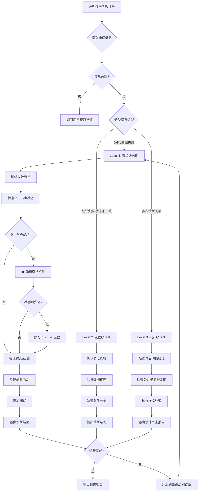
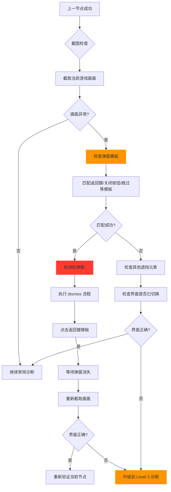
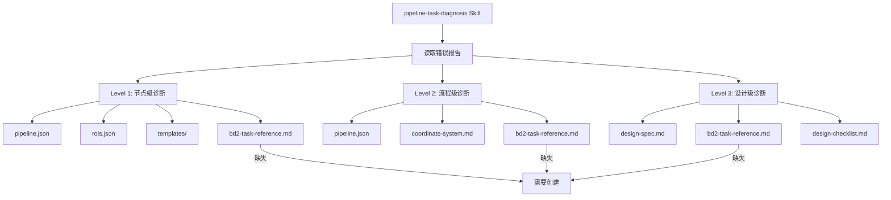

# Spec: Pipeline 任务失败调试流程 v1.0

> **版本**: 1.1.0  
> **创建日期**: 2026-08-09  
> **更新日期**: 2026-08-09  
> **状态**: ✅ 已归档（2026-08-09 评审通过，归档至 `docs/specs/archived/2026-08/`）
> **关联 Skill**: `pipeline-task-diagnosis`

> ⚠️ **本 Spec 已完成并归档**，实现产物已部署到以下位置：
> - Skill: `.skills/skills/pipeline-task-diagnosis/SKILL.md` (v2.1.0)
> - 诊断脚本: `agent/debug/_diag_*.py` (6 个脚本)
> - 文档: `resources/BrownDust II/docs/` (task-reference.md, roi-template-mapping.md, bd2-troubleshooting.md)

---

## 1. 背景与目标

### 1.1 问题描述

当前 GAF 系统在 pipeline 任务失败时，存在以下问题：

1. **触发机制不明确**: AI 在对话中收到任务失败报告后，没有标准化的流程来加载诊断技能
2. **诊断范围不完整**: 现有 `pipeline-task-diagnosis` skill 只覆盖节点级技术诊断（OCR/模板匹配/坐标），缺少流程级和设计级诊断
3. **文档引用缺失**: 诊断时需要的参考文档分散，且关键文档（如任务导航图）不存在
4. **调试日志不规范**: 缺少标准化的日志输出要求

### 1.2 目标

设计一套完整的 **Pipeline 任务失败调试流程**，包括：

- ✅ 明确的触发机制（何时加载诊断流程）
- ✅ 分级诊断体系（节点级 → 流程级 → 设计级）
- ✅ 标准化的文档引用清单
- ✅ 规范化的调试日志格式
- ✅ 可执行的调试步骤

---

## 2. 触发机制

### 2.1 触发条件

当满足以下任一条件时，AI **必须** 加载诊断流程：

#### 2.1.1 显式触发（用户主动报告）

| 触发条件 | 示例 | 加载的 Skill |
|----------|------|-------------|
| 用户报告任务失败 | "get_email 任务失败了" | `pipeline-task-diagnosis` |
| 用户报告节点超时 | "wait_regular_email OCR 超时" | `pipeline-task-diagnosis` |
| 用户询问失败原因 | "为什么点击后没反应" | `pipeline-task-diagnosis` |
| `gaf-orchestrator` 判定为 `bug_fix` 任务 | 决策树 step_1 输出 `task_type=bug_fix` | `gaf-reflect-and-evolve` |

#### 2.1.2 隐式触发（AI 主动发现）

> **关键原则**: 即使用户没有明确指出哪个任务错误，AI 在对话中发现以下模式时，**必须主动触发诊断**：

| 触发模式 | 示例 | 行动 |
|----------|------|------|
| 对话中提到任务失败关键词 | "失败"、"超时"、"报错"、"识别不到" | 主动加载 `pipeline-task-diagnosis` |
| 日志中出现错误信息 | agent 日志显示 `NODE_TIMEOUT`、`TEMPLATE_NOT_FOUND` | 主动分析根因 |
| 截图显示异常画面 | 截图中有弹窗遮挡、界面未切换 | 主动检查弹窗问题 |
| 用户描述"没反应"、"没变化" | 暗示点击/操作未生效 | 主动检查上一节点 |

### 2.2 弹窗遮挡检测触发

> **这是高频被忽视的失败场景**，必须作为主动触发的独立条件：

**触发条件**：当满足以下所有条件时，**立即执行弹窗检测**：
- 上一节点报告成功（如 `click_on_match: success`）
- 当前节点持续失败（如 OCR 11 次全部乱码）
- 截图显示画面异常（有弹窗/遮罩/未预期的界面元素）

**检测步骤**：
```
Step 1: 截图并检查画面
  ↓
Step 2: 检查是否有弹窗模板匹配 (dismiss_popup)
  ↓
Step 3: 如有弹窗，执行 dismiss 流程
  ↓
Step 4: 重新验证当前节点
```

### 2.3 加载顺序

```
Step 1: 加载 pipeline-task-diagnosis Skill
  ↓
Step 2: 读取失败报告内容
  ↓
Step 3: 分类错误类型
  ↓
Step 4: 按分级流程执行诊断
  ↓
Step 5: 输出诊断报告
```

### 2.3 禁止行为

- ❌ 收到失败报告后直接回答"不知道"或让用户提供更多信息
- ❌ 跳过分级流程直接猜测根因
- ❌ 不加载诊断 Skill 就开始分析

---

## 3. 分级诊断体系

### 3.1 三级诊断架构

```
Level 1: 节点级诊断 (Node-Level)
  → 检查单个节点的配置、输入、输出
  → 适用: OCR 超时、模板匹配失败、点击未生效
  
Level 2: 流程级诊断 (Flow-Level)
  → 检查节点间的连接、数据传递、条件分支
  → 适用: 节点成功但后续节点仍失败、状态不一致
  
Level 3: 设计级诊断 (Design-Level)
  → 检查 pipeline 的整体设计是否合理
  → 适用: 缺少验证节点、无条件分支、界面跳转逻辑错误
```

### 3.2 诊断流程决策树

```
收到任务失败报告
    │
    ├─ Step 1: 提取错误信息
    │   ├─ 从用户描述中提取: pipeline_name, node_id, error_type
    │   └─ 如信息不全 → 询问用户获取完整错误信息
    │
    ├─ Step 2: 分类错误类型
    │   │
    │   ├─ NODE_TIMEOUT / OCR 超时 / 模板匹配失败
    │   │   → Level 1: 节点级诊断
    │   │
    │   ├─ 上一节点成功但当前节点仍失败
    │   │   → Level 2: 流程级诊断
    │   │
    │   └─ 多次诊断无法定位根因
    │       → Level 3: 设计级诊断
    │
    └─ Step 3: 执行对应级别的诊断流程
```

---

## 4. Level 1: 节点级诊断流程

### 4.1 适用场景

- OCR 超时（如 `wait_regular_email` 15s 超时）
- 模板匹配失败（如 `open_mailbox` 找不到邮箱图标）
- 点击未生效（如 `click_on_match` 成功但游戏无反应）
- 坐标错误（如点击位置偏移）

### 4.2 诊断步骤

```
节点级诊断流程
    │
    ├─ ① 确认失败节点
    │   ├─ 读取错误报告中的 node_id
    │   ├─ 读取 pipeline.json 获取节点配置
    │   └─ 记录: node_id, node_type, config
    │
    ├─ ② 检查上一节点状态
    │   ├─ 读取 pipeline.json 的 edges
    │   ├─ 确定上一节点 source node
    │   └─ 检查上一节点是否成功
    │       ├─ 成功 → 继续诊断（检查弹窗遮挡！）
    │       └─ 失败 → 可能是级联错误，返回 Level 2
    │
    ├─ ③ 弹窗遮挡检测（★ 高频失败场景）
    │   ├─ 截图并检查画面: 截取当前游戏画面
    │   ├─ 检查是否有弹窗: 用公共弹窗模板（返回键、关闭按钮等）匹配
    │   ├─ 检查画面是否符合预期: 界面是否已切换到目标页面?
    │   └─ 如检测到弹窗:
    │       ├─ 执行 dismiss 流程 (click 返回键 + wait)
    │       ├─ 重新截取画面验证
    │       └─ 重新验证当前节点
    │
    ├─ ④ 验证输入
    │   ├─ 截取当前游戏画面 (capture_screen)
    │   ├─ 检查画面是否符合预期 (界面是否已切换)
    │   └─ 如有截图日志，对比成功截图与失败截图
    │
    ├─ ⑤ 验证配置
    │   ├─ ROI 坐标检查: 是否覆盖目标区域?
    │   ├─ 分辨率检查: 实际分辨率 vs 基准分辨率 (1920x1080)
    │   ├─ 阈值检查: threshold 是否合理?
    │   ├─ 超时检查: timeout 是否足够? (OCR 建议 >= 15s)
    │   └─ 截图方法检查: PrintWindow vs GDI 置信度对比
    │
    ├─ ⑥ 验证节点逻辑
    │   ├─ 隔离测试: 写独立脚本绕过 pipeline 直接跑该节点
    │   ├─ 单元测试: 直接调用节点的 execute 方法
    │   └─ 对比: 隔离测试结果 vs pipeline 中结果
    │
    ├─ ⑦ 同 ROI 模板降级匹配（★ 关键诊断策略）
    │   ├─ 读取 bd2-roi-template-mapping.md 获取模板组
    │   ├─ 查找当前节点使用的模板所属 ROI
    │   ├─ 获取同 ROI 的其他模板列表
    │   ├─ 依次尝试匹配其他模板
    │   │   ├─ 成功 → 用匹配到的模板继续执行
    │   │   └─ 全部失败 → 继续下一步诊断
    │   └─ 记录降级匹配结果
    │
    └─ ⑧ 输出诊断结论
        ├─ 配置问题 → 给出修正建议
        ├─ 数据流问题 → 给出修正建议
        ├─ 弹窗遮挡 → 添加 dismiss 节点
        ├─ 模板问题 → 建议使用同 ROI 的其他模板
        └─ 代码问题 → 标记为 bug_fix 任务
```

### 4.3 常用诊断命令

```bash
# 1. 截图检查
# 运行节点诊断脚本
python debug/_diag_node.py --node-id wait_regular_email --pipeline resources/BrownDust\ II/pipelines/get_email.json

# 2. OCR 验证
# 全图 OCR 看文本位置
python debug/_diag_ocr.py --text "普通邮箱" --roi "[214,10,333,276]"

# 3. 模板匹配验证
# 对比不同截图方法的置信度
python debug/_diag_template.py --template templates/get_email/邮箱.png --roi "[1564,28,95,61]"

# 4. 弹窗检测（新增）
# 检查当前画面是否有弹窗
python debug/_diag_popup.py --popup-templates "templates/public/返回键1.png,templates/public/跳过.png" --roi "[100,0,300,100]"

# 5. 同 ROI 模板降级匹配（关键诊断策略）
# 当一个模板匹配失败时，自动尝试同 ROI 的其他模板
python debug/_diag_template_fallback.py --primary-template "templates/get_email/邮箱.png" --roi "[1564,28,95,61]" --mapping "resources/BrownDust II/docs/bd2-roi-template-mapping.md"

# 6. 完整诊断（推荐）
# 一键执行所有诊断步骤
python debug/_diag_full.py --pipeline get_email --node wait_regular_email
```

### 4.4 同 ROI 模板降级匹配策略

> **核心洞察**：相同 ROI 坐标的模板通常对应界面上的**同一个组件**（按钮的不同状态、同一区域的不同文本等）。

**触发条件**：当满足以下任一条件时，执行降级匹配：
- [ ] 主模板匹配失败（`template_match` 返回置信度 < threshold）
- [ ] OCR 在 ROI 内未找到目标文本
- [ ] 截图显示组件状态不确定（如按钮可能是"激活"或"禁用"状态）

**降级匹配流程**：
```
1. 读取 bd2-roi-template-mapping.md 获取 ROI→模板组映射
2. 查找当前节点使用的模板所属 ROI
3. 获取同 ROI 的所有模板（包括当前模板）
4. 依次尝试匹配每个模板
   - 匹配成功（置信度 >= threshold）→ 使用该模板
   - 匹配失败 → 继续尝试下一个
5. 记录所有模板的匹配结果
6. 输出降级匹配报告
```

**伪代码示例**：
```python
def template_fallback_match(screen, roi, primary_template_path, mapping_doc):
    """同 ROI 模板降级匹配"""
    # 1. 从映射表获取同 ROI 的模板列表
    templates = get_templates_for_roi(mapping_doc, roi)
    
    # 2. 按优先级排序（主模板优先，其他模板按名称相似度排序）
    sorted_templates = prioritize_templates(primary_template_path, templates)
    
    # 3. 依次尝试匹配
    results = []
    for template_path in sorted_templates:
        result = template_match(screen, template_path, roi=roi, threshold=0.7)
        results.append({
            'template': template_path,
            'confidence': result.confidence,
            'success': result.success
        })
        if result.success:
            logger.info(f"降级匹配成功: {template_path} (confidence={result.confidence:.3f})")
            return result
    
    # 4. 全部失败
    logger.warning(f"所有模板匹配失败: {[r['template'] for r in results]}")
    return None
```

### 4.5 弹窗遮挡检测清单

> **当满足以下任一条件时，必须执行弹窗检测**：

- [ ] 上一节点成功，当前节点持续失败
- [ ] 截图画面与预期不符（有遮罩/弹窗/未加载界面）
- [ ] OCR 全部返回乱码（可能被弹窗遮挡）
- [ ] 模板匹配在正确 ROI 内找不到目标
- [ ] 用户反馈"画面变了"但节点仍报错

**检测步骤**：

```python
# 弹窗检测伪代码
def detect_popup(screen, pipeline_config):
    # 1. 获取公共弹窗模板列表
    popup_templates = get_popup_templates(pipeline_config)
    
    # 2. 用模板匹配检查是否有弹窗
    for template in popup_templates:
        match_result = template_match(screen, template, threshold=0.7)
        if match_result.success:
            logger.warning(f"检测到弹窗: {template.name}, 位置: {match_result.bbox}")
            return True, match_result
    
    # 3. 检查界面是否已切换
    expected_screen = get_expected_screen(pipeline_config)
    if not screen_matches_expected(screen, expected_screen):
        logger.warning("界面与预期不符，可能有弹窗遮挡")
        return True, None
    
    return False, None
```

---

## 5. Level 2: 流程级诊断流程

### 5.1 适用场景

- 上一节点成功但当前节点仍失败（如 `open_mailbox` 成功但 `wait_regular_email` 仍超时）
- 状态不一致（如检测到邮箱存在但点击领取失败）
- 条件分支判断错误（如空邮箱判断为非空）

### 5.2 诊断步骤

```
流程级诊断流程
    │
    ├─ ① 确认节点连接
    │   ├─ 读取 pipeline.json 的 edges 定义
    │   ├─ 确认失败节点的前驱节点
    │   └─ 检查 edges 是否正确连接
    │
    ├─ ② 验证数据传递
    │   ├─ 检查 publish_match_pos 输出的坐标
    │   ├─ 检查后续节点读取的坐标
    │   ├─ 验证 coord_transformer 是否正确传递
    │   └─ 对比: 写入值 vs 读取值 是否一致
    │
    ├─ ③ 验证条件分支
    │   ├─ 检查 branch 节点的 condition
    │   ├─ 检查变量名是否正确
    │   ├─ 检查 operator 是否正确 (eq/ne/gt/lt)
    │   └─ 检查 true_branch / false_branch 是否指向正确节点
    │
    ├─ ④ 验证循环/重试
    │   ├─ 检查 retry 配置
    │   ├─ 检查循环退出条件
    │   └─ 检查最大迭代次数
    │
    └─ ⑤ 输出诊断结论
        ├─ 连接问题 → 修正 edges 定义
        ├─ 数据传递问题 → 修正 coord_transformer / 变量名
        └─ 分支逻辑问题 → 修正 condition / 分支目标
```

### 5.3 数据流检查清单

```text
□ 1. publish_match_pos 写入字段 (x, y, source, extra) 与 resolve_target 读取字段一致?
□ 2. 坐标系统是否标注? (logical / physical / sub-image)
□ 3. 坐标系统是否正确传递?
□ 4. ROI 偏移是否正确加回? (子图坐标 + ROI 原点)
□ 5. 变量引用契约是否满足? (dict 含 x/y 或 center.x/y)
□ 6. None 兜底是否处理?
```

---

## 6. Level 3: 设计级诊断流程

### 6.1 适用场景

- 多次节点级/流程级诊断无法定位根因
- pipeline 设计模式存在结构性问题
- 新增 pipeline 或重构现有 pipeline

### 6.2 诊断步骤

```
设计级诊断流程
    │
    ├─ ① 检查界面切换验证
    │   ├─ 每个 click_on_match 节点后是否有 wait_for_interface_visible?
    │   ├─ 对比同项目其他 pipeline 的设计模式
    │   └─ 缺少验证 → 添加 wait_for_visible 节点
    │
    ├─ ② 检查公共子流程复用
    │   ├─ 是否重复实现"返回主界面"逻辑?
    │   ├─ 是否应该复用 back_to_main.json?
    │   └─ 重复逻辑 → 提取为公共子流程
    │
    ├─ ③ 检查错误处理
    │   ├─ 关键节点是否有 continue_on_error?
    │   ├─ 失败后是否有降级方案?
    │   └─ 不可恢复错误 → 添加明确的失败节点
    │
    ├─ ④ 检查硬编码
    │   ├─ 是否有硬编码的坐标值? (应使用 roi)
    │   ├─ 是否有硬编码的超时值? (应配置化)
    │   └─ 硬编码 → 提取为配置
    │
    ├─ ⑤ 检查可维护性
    │   ├─ 节点 ID 是否语义清晰?
    │   ├─ 节点描述是否完整?
    │   └─ 命名不规范 → 重命名
    │
    └─ ⑥ 输出设计审查报告
        ├─ 设计缺陷列表
        ├─ 改进建议
        └─ 优先级排序
```

### 6.3 设计规范检查清单

```text
□ 1. 每个 click_on_match 后必须有 wait_for_visible 验证
□ 2. 返回主界面逻辑必须复用 back_to_main.json
□ 3. 关键节点必须有 continue_on_error 配置
□ 4. 禁止硬编码坐标值（必须使用 roi）
□ 5. 超时值必须配置化（禁止 magic number）
□ 6. 节点 ID 必须语义清晰（禁止 n1, n2, step_1 等）
□ 7. 每个节点必须有 description 或 comment
```

---

## 7. 文档依赖清单

### 7.1 资源目录结构（当前状态 + 归一化方案）

#### 当前实际状态（⚠️ 半归一化，存在不一致）

```
resources/<game>/
  ├── pipelines/         # 🔴 旧格式，但仍有 3 处代码写入/读取
  │   └── *.json        # ← write_task_to_json_file() 写这里
  ├── tasks/            # 🟡 新格式，读取端支持但写入端不支持
  │   └── *.json        # ← 没人往这里写，文件是手动复制的副本
  ├── config/
  ├── monitors/
  ├── templates/
  └── manifest.json
```

#### 代码引用情况（2026-08-09 归一化完成后）

| 操作 | 读 pipelines/ | 读 tasks/ | 写回位置 | 文件 |
|------|:-:|:-:|------|------|
| 导入到 DB | ✅ (兼容) | ✅ (优先) | — | `import_utils.py:302-308` |
| **写回 JSON** | — | — | **tasks/** ✅ | `import_utils.py:382` |
| **任务计数** | ✅ (回退) | ✅ (优先) | — | `serializers.py:44` |
| **同步脚本** | ✅ (回退) | ✅ (优先) | — | `sync_brown_dust_pipelines_to_db.py:150-155` |
| 回填脚本 | ✅ (回退) | ✅ (优先) | — | `backfill_resource_pack.py:90-114` |
| 深度导入 | ✅ | ✅ | — | `migrate_resource_pack.py:39` |

#### 归一化方案（✅ 2026-08-09 已完成）

**目标**: `tasks/` 成为唯一数据源，`pipelines/` 彻底移除。

| 步骤 | 改动 | 涉及文件 | 状态 |
|------|------|----------|------|
| **Step 1**: 写入端归一化 | `write_task_to_json_file()` 改写 `tasks/` | `import_utils.py:382` | ✅ 完成 |
| **Step 2**: 计数端归一化 | `get_task_count()` 改为数 `tasks/` | `serializers.py:44` | ✅ 完成 |
| **Step 3**: 同步脚本归一化 | `sync_brown_dust_pipelines_to_db.py` 改同步 `tasks/` | `sync_brown_dust_pipelines_to_db.py` | ✅ 完成 |
| **Step 4**: 删除旧目录 | 移除所有 `pipelines/` 目录 | `resources/*/pipelines/` | ✅ 完成 |

**额外修复**:
- ✅ `backfill_resource_pack.py`: 修复读 `tasks/*.yaml` → 读 `tasks/*.json`，优先 `tasks/`
- ✅ `test_get_email_real.py`: 修复硬编码路径
- ✅ `delete_task_json_file()`: 同步更新为 `tasks/`

**测试结果**:
- Resources 测试: 7 passed ✅
- Tasks 测试: 202 passed ✅
- Pipeline 测试: 257 passed ✅
- 同步脚本: 15 pipelines 全部从 `tasks/` 正确读取 ✅

#### 归一化后的标准结构

```
resources/<game>/
  ├── config/           # 配置文件
  │   ├── rois.json     # ROI 区域坐标
  │   └── settings.json # 游戏设置
  ├── monitors/         # 监控器配置
  ├── tasks/            # ✅ 唯一数据源（读写统一）
  │   └── *.json        # Pipeline 定义文件
  ├── templates/        # 模板图像
  │   ├── common/       # 公共模板
  │   └── <task>/       # 各任务专用模板
  ├── docs/             # ✅ 必需：诊断参考文档
  │   ├── task-reference.md        # **界面导航图 + 任务参考**（必需）
  │   └── roi-template-mapping.md  # **ROI-模板组映射**（必需）
  └── manifest.json     # 任务清单
```

**强制要求清单**：
- ✅ `tasks/*.json` — **唯一数据源**（读写统一，禁止同时存在 `pipelines/`）
- ✅ `docs/task-reference.md` — **界面导航图**（每个游戏必须有）
- ✅ `docs/roi-template-mapping.md` — **ROI-模板组映射**（每个游戏必须有）

### 7.2 历史说明

| 时间点 | 事件 | 残留问题 |
|--------|------|----------|
| 2026-07 前 | `pipelines/` 是唯一目录 | 无 `tasks/` 目录 |
| 2026-07 归一化 | 新增 `tasks/` 目录，`import_pipelines()` 支持同时读两个目录 | **写入端未同步改**（仍写 `pipelines/`） |
| 2026-08 现状 | 两个目录共存，内容相同 | `write_task_to_json_file()` 仍写 `pipelines/`，`get_task_count()` 只数 `pipelines/` |

### 7.3 诊断时需要查阅的文档

| 文档 | 路径 | 用途 | 优先级 |
|------|------|------|--------|
| 任务定义 | `resources/<game>/tasks/*.json` | 节点配置、边连接 | 🔴 必须 |
| ROI 坐标 | `resources/<game>/config/rois.json` | ROI 区域坐标 | 🔴 必须 |
| 模板图像 | `resources/<game>/templates/*/*.png` | 模板匹配用 | 🔴 必须 |
| 任务清单 | `resources/<game>/manifest.json` | 版本、描述 | 🟡 重要 |
| **界面导航图** | `resources/<game>/docs/task-reference.md` | **任务入口/出口/界面跳转** | 🔴 **必须** |
| **ROI-模板映射** | `resources/<game>/docs/roi-template-mapping.md` | **同 ROI 多模板关系** | 🔴 **必须** |
| 坐标系统 | `.ai-memory/games/<game>/coordinate-system.md` | 坐标转换规则 | 🟡 重要 |
| 常见任务 | `.ai-memory/games/<game>/common-tasks.md` | 任务速查 | 🟢 辅助 |

### 7.4 缺失文档检查

以下文档是**每个游戏资源必须存在**的，目前部分游戏缺失：

| 游戏 | 缺失文档 | 影响 | 修复优先级 |
|------|----------|------|-----------|
| BrownDust II | `docs/task-reference.md` | AI 无法判断任务入口/出口 | **P0** |
| BrownDust II | `docs/roi-template-mapping.md` | 模板匹配失败时无法降级 | **P0** |
| GAF Default | `docs/task-reference.md` | AI 无法判断任务入口/出口 | **P0** |
| GAF Default | `docs/roi-template-mapping.md` | 模板匹配失败时无法降级 | **P0** |

### 7.4 文档内容要求

#### task-reference.md（界面导航图）必须包含

> **这是最关键的诊断文档**，没有它 AI 无法判断"任务是否成功执行"。

```markdown
# <游戏名> 任务参考文档

## 1. 界面导航图（核心）
[绘制从主菜单到各功能界面的完整路径图]
[标注每个界面的关键模板]
[标注界面切换的触发条件]

## 2. 任务总览
| Pipeline | 入口界面 | 出口界面 | 依赖模板 | 描述 |
|----------|----------|----------|----------|------|
| get_email | 主界面 | 主界面 | 邮箱.png, 空邮箱标识.png | 领取邮箱奖励 |
| get_guild | 主界面 | 公会界面 | 公会标识.png | 进入公会 |

## 3. 界面状态机
[用 Mermaid 或表格描述界面状态转换]
[例如: 主界面 → 点击邮箱 → 邮箱列表 → 点击领取 → 返回主界面]

## 4. 常见问题
[FAQ 和排查指南]
```

#### roi-template-mapping.md（ROI-模板组映射）必须包含

> **这是关键的诊断文档**，当模板匹配失败时，可通过此表快速找到同 ROI 的替代模板。

```markdown
# <游戏名> ROI 与模板组映射

## 核心发现
相同 ROI 坐标的模板通常对应界面上的**同一个组件**（如按钮的不同状态：默认/悬停/禁用/高亮）。
当一个模板匹配失败时，应尝试用同 ROI 下的其他模板进行降级匹配。

## 映射表格式

| ROI 坐标 [x, y, w, h] | 组件名称 | 模板组（同 ROI） | 用途 | 备注 |
|------------------------|----------|------------------|------|------|
| [1564, 28, 95, 61]     | 邮箱按钮 | 邮箱.png<br>空邮箱.png<br>邮箱_高亮.png | 点击进入邮箱 | 游戏界面右上角 |
| [214, 10, 333, 276]    | 邮箱列表区域 | 普通邮箱.png<br>VIP邮箱.png<br>系统邮件.png | OCR 识别邮箱类型 | 邮箱主内容区 |

## 使用场景
1. **模板匹配失败**：用"邮箱.png"匹配失败 → 查映射表发现同 ROI 还有"空邮箱.png" → 尝试匹配"空邮箱.png"
2. **OCR 全部乱码**：截图被弹窗遮挡 → 用同 ROI 的弹窗关闭按钮模板尝试关闭
3. **界面状态不确定**：不确定当前是"VIP邮箱"还是"普通邮箱" → 用同 ROI 的多个模板分别匹配
```

---

## 8. 调试日志规范

### 8.1 日志格式

诊断过程中必须输出结构化日志，格式如下：

```
[DIAG] Level=<level> | Pipeline=<name> | Node=<id> | Error=<type>
[DIAG] Step=<n>/<total> | Action=<action> | Result=<result>
[DIAG] Finding=<description>
[DIAG] Recommendation=<suggestion>
```

### 8.2 日志示例

#### 示例 1: 常规节点诊断（无弹窗）

```
[DIAG] Level=1 | Pipeline=get_email | Node=wait_regular_email | Error=NODE_TIMEOUT
[DIAG] Step=1/7 | Action=确认失败节点 | Result=node_id=wait_regular_email, type=wait(ocr)
[DIAG] Step=2/7 | Action=检查上一节点 | Result=open_mailbox: ✅ success (confidence=0.9364)
[DIAG] Step=3/7 | Action=弹窗遮挡检测 | Result=无弹窗模板匹配，界面正常
[DIAG] Step=4/7 | Action=验证输入 | Result=截图显示: 游戏画面未切换，仍在主界面
[DIAG] Step=5/7 | Action=验证配置 | Result=ROI=[214,10,333,276] 覆盖正确，但目标文本不在此区域
[DIAG] Step=6/7 | Action=验证节点逻辑 | Result=隔离测试通过，但 pipeline 中失败
[DIAG] Finding=open_mailbox 点击后游戏界面未切换，wait_regular_email 等待的文本从未出现
[DIAG] Recommendation=在 open_mailbox 和 wait_regular_email 之间添加 wait_mailbox_visible 验证节点
```

#### 示例 2: 弹窗遮挡诊断（检测到弹窗）

```
[DIAG] Level=1 | Pipeline=get_email | Node=wait_regular_email | Error=NODE_TIMEOUT
[DIAG] Step=1/7 | Action=确认失败节点 | Result=node_id=wait_regular_email, type=wait(ocr)
[DIAG] Step=2/7 | Action=检查上一节点 | Result=open_mailbox: ✅ success (confidence=0.9364)
[DIAG] Step=3/7 | Action=弹窗遮挡检测 | Result=⚠️ 检测到弹窗! 匹配到 [返回键1.png], 位置=(120, 50)
[DIAG] Step=3/7a | Action=执行 dismiss 流程 | Result=点击返回键模板, 等待弹窗消失...
[DIAG] Step=3/7b | Action=重新截取画面 | Result=弹窗已消失，界面已切换到邮箱列表
[DIAG] Step=4/7 | Action=重新验证输入 | Result=截图显示: 邮箱界面正确显示，目标文本在 ROI 内
[DIAG] Step=5/7 | Action=验证配置 | Result=ROI=[214,10,333,276] 覆盖正确
[DIAG] Step=6/7 | Action=验证节点逻辑 | Result=隔离测试通过，pipeline 中测试也通过
[DIAG] Finding=open_mailbox 点击后出现意外弹窗，遮挡了目标区域
[DIAG] Recommendation=在 open_mailbox 后添加 dismiss_popup 节点，处理可能出现的弹窗
```

#### 示例 3: 同 ROI 模板降级匹配（关键诊断策略）

```
[DIAG] Level=1 | Pipeline=get_email | Node=open_mailbox | Error=TEMPLATE_NOT_FOUND
[DIAG] Step=1/7 | Action=确认失败节点 | Result=node_id=open_mailbox, type=template_match
[DIAG] Step=2/7 | Action=检查上一节点 | Result=navigate_to_mail: ✅ success
[DIAG] Step=3/7 | Action=弹窗遮挡检测 | Result=无弹窗模板匹配，界面正常
[DIAG] Step=4/7 | Action=验证输入 | Result=截图显示: 游戏画面正确，主界面可见
[DIAG] Step=5/7 | Action=验证配置 | Result=ROI=[1564,28,95,61] 覆盖正确
[DIAG] Step=6/7 | Action=同 ROI 模板降级匹配 | Result=
  [DIAG]   读取 bd2-roi-template-mapping.md
  [DIAG]   ROI=[1564,28,95,61] 的模板组: [邮箱.png, 空邮箱.png, 邮箱_高亮.png]
  [DIAG]   尝试 1/3: 邮箱.png → ❌ (confidence=0.45 < 0.7)
  [DIAG]   尝试 2/3: 空邮箱.png → ❌ (confidence=0.32 < 0.7)
  [DIAG]   尝试 3/3: 邮箱_高亮.png → ✅ (confidence=0.91 >= 0.7)
  [DIAG]   🎯 降级匹配成功: 邮箱_高亮.png
[DIAG] Step=7/7 | Action=输出诊断结论 | Result=模板匹配成功，使用"邮箱_高亮.png"
[DIAG] Finding=主模板"邮箱.png"匹配失败，但同 ROI 的"邮箱_高亮.png"匹配成功
[DIAG] Recommendation=1. 更新 pipeline 使用"邮箱_高亮.png"作为主模板
[DIAG]                2. 在 bd2-roi-template-mapping.md 中标记此模板组的优先级
```

### 8.3 日志目录

```
debug/YYYYMMDD/diag_<method>/
  ├─ screenshots/
  │   ├─ annotated/    # 标注后的截图
  │   └─ raw/          # 原始截图
  ├─ logs/
  │   └─ diag_<timestamp>.log  # 诊断日志
  └─ result.json       # 诊断结果
```

---

## 9. Skill 更新机制

### 9.1 触发更新条件

每次诊断完成后，如发现以下情况，必须更新 `pipeline-task-diagnosis/SKILL.md`：

1. **现有流程未覆盖的新根因** → 追加到"常见错误模式"表
2. **新的诊断方法/脚本** → 追加到"快速诊断脚本"模板
3. **现有方法无效，用新思路解决** → 更新诊断流程
4. **发现更好的诊断方法** → 替换或补充现有方法

### 9.2 更新示例

```markdown
# 新增: Level 3 设计级诊断
# 在「分级诊断体系」中补充

## 常见设计缺陷
| 缺陷 | 影响 | 修复方法 |
|------|------|----------|
| 缺少界面验证节点 | OCR 超时、点击无效 | 添加 wait_for_visible 节点 |
| 重复实现公共逻辑 | 维护成本高 | 提取为公共子流程 |
| 硬编码坐标值 | 分辨率变化时失效 | 使用 roi + coord_transformer |
```

---

## 10. 逻辑图

### 10.1 触发机制流程图

```mermaid
flowchart TD
    subgraph "主动触发（AI 自动检测）"
        A1[对话中提到失败关键词] --> B{触发诊断?}
        A2[日志显示错误码] --> B
        A3[截图显示异常画面] --> B
        A4[用户描述"没反应"] --> B
    end
    
    subgraph "显式触发（用户主动报告）"
        C1["get_email 任务失败了"] --> B
        C2["wait_regular_email OCR 超时"] --> B
        C3[为什么点击后没反应] --> B
    end
    
    B -->|是| D[加载 pipeline-task-diagnosis]
    B -->|否| E[继续当前对话]
```

### 10.2 完整诊断流程图（含弹窗检测）



### 10.3 弹窗遮挡检测流程图



### 10.2 文档依赖关系图



---

## 11. 实施计划

### 11.1 分阶段实施

| 阶段 | 内容 | 产出 | 优先级 | 状态 |
|------|------|------|--------|------|
| **Phase 1** | 更新 `pipeline-task-diagnosis/SKILL.md` | 完整诊断流程 | P0 | ✅ 已完成 |
| **Phase 2** | 创建 `task-reference.md` + `roi-template-mapping.md` | BD2 + GAF Default 文档 | P0 | ✅ 已完成 |
| **Phase 3** | 更新 `gaf-orchestrator` 决策树 | 添加失败路由 | P1 | ✅ 已完成 |
| **Phase 4** | 创建诊断脚本模板 (6 个脚本) | `agent/debug/_diag_*.py` | P1 | ✅ 已完成 |
| **Phase 5** | 创建 `bd2-troubleshooting.md` | 故障排查指南 | P2 | ✅ 已完成 |

### 11.2 完成详情

#### Phase 1 ✅ 完成
- 更新 `.skills/skills/pipeline-task-diagnosis/SKILL.md` (v2.0.0)
- 添加主动触发机制、弹窗检测、同 ROI 降级匹配
- 更新文档依赖清单、日志规范、调试目录规范

#### Phase 2 ✅ 完成
- 创建 `resources/BrownDust II/docs/task-reference.md` (v1.2.0)
- 创建 `resources/BrownDust II/docs/roi-template-mapping.md`
- 创建 `resources/GAF Default/docs/task-reference.md`
- 创建 `resources/GAF Default/docs/roi-template-mapping.md`

#### Phase 3 ✅ 完成
- 更新 `.skills/skills/gaf-orchestrator/SKILL.md`
- bug_fix 分支 step_4_diagnose 添加 `pipeline-task-diagnosis` 调用
- bug_fix 分支 step_5_fix_and_reflect 添加 Skill 自我更新检查

#### Phase 4 ✅ 完成
- `agent/debug/_diag_node.py` - 节点隔离测试 (支持 template_match/ocr/wait 节点)
- `agent/debug/_diag_ocr.py` - OCR 诊断 (全图 vs ROI 裁剪对比)
- `agent/debug/_diag_template.py` - 模板匹配诊断 (对比不同截图方法)
- `agent/debug/_diag_popup.py` - 弹窗检测 (公共弹窗模板匹配)
- `agent/debug/_diag_template_fallback.py` - 同 ROI 降级匹配 (读取映射文档)
- `agent/debug/_diag_full.py` - 完整诊断 (Level 1-3 分级诊断)

#### Phase 5 ✅ 完成
- 创建 `resources/BrownDust II/docs/bd2-troubleshooting.md` (v1.0.0)
- 包含快速排查流程、高频故障场景、各任务排查表
- 包含快速命令速查、关键参数速查、日志规范

---

## 附录 A: 现有 Skill 问题

### A.1 现有 `pipeline-task-diagnosis` Skill 的问题

| 问题 | 描述 | 修复方案 |
|------|------|----------|
| 触发机制不明确 | 没有定义何时加载 Skill | 添加第 2 章：触发机制 |
| 诊断范围不完整 | 只有节点级诊断，缺少流程级和设计级 | 添加第 3-6 章：分级诊断 |
| 文档引用过时 | `BrownDust-II` 应为 `BrownDust II` | 修正路径 |
| 缺少日志规范 | 没有标准化的日志格式 | 添加第 8 章：日志规范 |
| 缺少流程图 | 没有可视化的诊断流程 | 添加第 10 章：逻辑图 |

### A.2 需要删除/保留的内容

- ✅ 保留：现有"常见错误模式"表（补充流程级和设计级错误）
- ✅ 保留：现有"快速诊断脚本"（补充流程级和设计级脚本）
- ❌ 删除：过时的文档路径引用
- 🔄 更新：BD2 已知参数（补充界面导航信息）

---

## 附录 B: 与现有系统的关系

### B.1 与 `gaf-orchestrator` 的关系

```
gaf-orchestrator 决策树
    │
    ├─ step_1: 判定 task_type
    │   ├─ new_feature → gaf-task-execution
    │   ├─ bug_fix → gaf-reflect-and-evolve
    │   ├─ documentation → gaf-knowledge-base
    │   ├─ refactor → gaf-task-execution
    │   └─ unknown → 询问用户
    │
    ├─ [新增] step_1.5: 任务失败检测
    │   └─ 检测到失败 → 加载 pipeline-task-diagnosis
    │
    └─ step_2: 路由到对应 Skill
```

### B.2 与 agent 内部诊断的关系

agent 代码中有 `_llm_diagnose_pipeline_failure` 方法，它与本 Spec 的关系：

| 维度 | agent 内部诊断 | 本 Spec 诊断 |
|------|---------------|-------------|
| 触发时机 | pipeline 失败时自动触发 | 用户报告失败后手动触发 |
| 执行主体 | agent 代码 | AI 对话 |
| 诊断范围 | 仅技术层面 | 技术 + 流程 + 设计 |
| 产出 | 附加到 result.data 的诊断信息 | 完整诊断报告 |
| 适用场景 | agent 运行时的实时诊断 | 用户发现问题后的深度分析 |

**结论**: 两者互补，不冲突。agent 内部诊断用于实时反馈，本 Spec 用于深度分析。

---

## 12. 验收标准

### 12.1 Phase 1 验收 ✅ 已完成

- [x] `pipeline-task-diagnosis/SKILL.md` 已更新，包含完整诊断流程
- [x] Skill 能正确识别触发条件
- [x] Skill 引用的文档路径正确
- [x] 诊断流程图能正确展示

### 12.2 Phase 2 验收 ✅ 已完成

- [x] `bd2-task-reference.md` 已创建 → `resources/BrownDust II/docs/task-reference.md`
- [x] `bd2-roi-template-mapping.md` 已创建 → `resources/BrownDust II/docs/roi-template-mapping.md`
- [x] `GAF Default/docs/task-reference.md` 已创建
- [x] `GAF Default/docs/roi-template-mapping.md` 已创建
- [x] 包含所有 pipeline 的入口/出口信息
- [x] 包含界面导航图
- [x] 包含常见问题 FAQ

### 12.3 Phase 3 验收 ✅ 已完成

- [x] `gaf-orchestrator` 决策树已更新
- [x] bug_fix 分支 step_4_diagnose 包含 `pipeline-task-diagnosis` 调用
- [x] bug_fix 分支 step_5_fix_and_reflect 包含 Skill 自我更新检查

### 12.4 Phase 4 验收 ✅ 已完成

- [x] `agent/debug/_diag_node.py` 已创建 - 节点隔离测试
- [x] `agent/debug/_diag_ocr.py` 已创建 - OCR 诊断
- [x] `agent/debug/_diag_template.py` 已创建 - 模板匹配诊断
- [x] `agent/debug/_diag_popup.py` 已创建 - 弹窗检测
- [x] `agent/debug/_diag_template_fallback.py` 已创建 - 同 ROI 降级匹配
- [x] `agent/debug/_diag_full.py` 已创建 - 完整诊断 (Level 1-3)

### 12.5 Phase 5 验收 ✅ 已完成

- [x] `resources/BrownDust II/docs/bd2-troubleshooting.md` 已创建
- [x] 包含快速排查流程
- [x] 包含高频故障场景（弹窗遮挡、OCR 超时、模板匹配失败等）
- [x] 包含各任务常见问题排查表
- [x] 包含快速诊断命令速查
- [x] 包含关键参数速查

### 12.6 最终验收（待验证）

- [ ] 模拟任务失败场景，AI 能正确加载诊断流程
- [ ] AI 能按分级流程执行诊断
- [ ] AI 能输出规范化的诊断日志
- [ ] 诊断完成后，Skill 能正确自我更新
