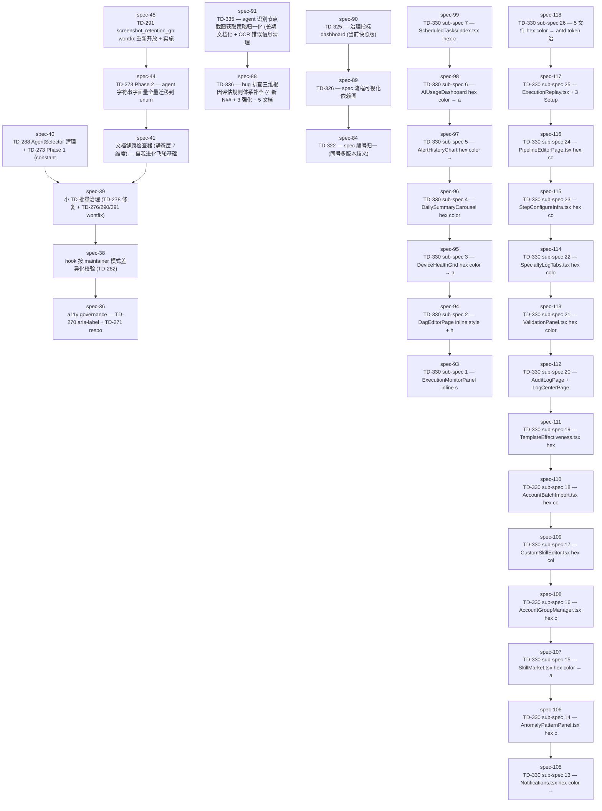

# Spec 依赖关系图 (auto-generated by spec_dependency_graph.py)

> 总计 **80** 个 spec | **28** 条依赖边 | **47** 个孤立 spec | 覆盖率 **41.2%**
> 最后生成: 由 `scripts/governance/spec_dependency_graph.py` 自动生成 (TD-326 spec-89).
> 依赖来源: frontmatter `depends_on` 字段 + 正文 `spec-XX 完成后/之后/引入/创建/建立` + `前置/依赖 spec-XX` 模式提取.

## 依赖图 (mermaid)

## 孤立 spec 清单 (无依赖关系)

> 47 个 spec 无显式/隐式依赖关系, 未画入上图.

- `spec-25` — 
- `spec-26` — 
- `spec-27` — 
- `spec-28` — 
- `spec-33` — 
- `spec-34` — 
- `spec-35` — 
- `spec-37` — 
- `spec-42` — 自我进化飞轮 — consumed 标记 + AI patch + 自动 commit + lesson 沉淀
- `spec-43` — 遗忘机制 (Forgetting Mechanism) — consumed.json 无界增长治理
- `spec-46` — d4_path_drift evidence/ 降级 + GAF/ 前缀批量修复
- `spec-47` — TD-279 batch fix — lessons/summaries/platforms path drift 173 P0
- `spec-48` — P1 batch fix — frontmatter missing fields + count drift + bloat
- `spec-49` — AI self-decide framework hardening — 5 layers 7 improvements
- `spec-50` — d7_index_consistency checker scope fix — eliminate b_minus_a false positives
- `spec-51` — d2_bloat fix — architecture-mistakes.md N## redundant sections cleanup
- `spec-52` — Test resource pack cleanup — conftest.py autouse fixture
- `spec-53` — L3-4 B-class inclusion + d4/d7 residual governance
- `spec-54` — TD-281 migration to fixed.md + plan-44 status sync + B-9~B-14 new TD registration
- `spec-59-b` — 规则文档瘦身 v9.2 — rules §2.0.5 简化为指针 + active.md FIXED 段落迁出 (TD-302)
- `spec-59-c` — TD-303 工作流节奏调整 + 规则退役 + TD 登记上限
- `spec-59-d` — TD-298 N170/N165 规则退役 (N181 首次执行)
- `spec-59-e` — TD-297 集成层一致性治理 (raw SQL + 跨 app import + FrontendEventType + spec_id 冲突)
- `spec-60` — TD-307 failure-modes.md P5 阈值调整 (150→170) + 代码常量同步 (120→170)
- `spec-61` — TD-312 promote_lessons.py 2 bug 修复 (line_count 含 frontmatter + 常量与 frontmatter 无同步)
- `spec-62` — TD-311 N181 规则退役机制强化 (季度→月度 + Active N## > 70 硬阈值紧急评估)
- `spec-63` — TD-304 前端 raw fetch 鉴权 + URL 漏洞修复 (DailySummaryCarousel + InfraHealthPanel)
- `spec-64` — TD-308 backend 全套测试 526s 逼近 N177 <600s 阈值 — 评估 (A pytest-xdist vs B 拆分套件)
- `spec-65` — "TD-308-A pytest-xdist 并行化 + tech-stack.md 升级 L2 硬加载 (用户反馈: ai 每次都要找技术环境)"
- `spec-66` — TD-308 关闭 (A 方案 4.5x 加速验证通过, B 方案经 N167 评分不必要) + TD-309 wontfix (七维度评分 4 方案无明显领先)
- `spec-67` — TD-313 test_task_result_returns_ack Redis ping 同步阻塞 4s 超时 (修复 redis_utils.get_redis_client 加 socket_timeout=0.2)
- `spec-68` — TD-310 07-20 单日 24 spec 异常集中 wontfix (评估结论: 真实工作量非过度拆分) + 循环模式规则强化沉淀 (N166 L3-2)
- `spec-69` — TD-300 后端 N+1 select_related 治理 (21 处审计 20 处已存在, 1 处修复 agents:325) + 登记 TD-314 (pytest-xdist MemoryError)
- `spec-70` — 
- `spec-71` — 
- `spec-72` — 
- `spec-75` — TD-294 Phase 3a — 扩展 utility class 体系 (Phase 3 前置依赖)
- `spec-76` — TD-294 Phase 3b — 批量替换 4 文件 50 处 inline style → className
- `spec-77` — TD-294 Phase 4a — 4 文件 ~22 处 hex 颜色 → antd design token
- `spec-78` — TD-294 Phase 4b — 高优 5 文件 toolbar → gaf-toolbar utility class
- `spec-79` — TD-294 Phase 4c — 中优 6 文件 toolbar → gaf-toolbar utility class
- `spec-82` — TD-320 — gaf_init.ps1 PowerShell 等价版本
- `spec-83` — TD-321 — B2 大修改 pre-commit hook 强制
- `spec-85` — TD-323 — SKILL.md frontmatter 时间戳自动化
- `spec-86` — TD-324 — N181 月度退役机制自动化
- `spec-87` — TD-331 — 代码-文档因果绑定 pre-commit hook
- `spec-92` — TD-327 — e2e run_all.py 接入 CI (weekly job + artifact + 通知)

## 同号多版本 (历史遗留, TD-322 wontfix)

> 同号多版本 (spec-36/38/39/41/42/43/44/45 各 2 个) 已在依赖图中合并为单节点.
> 详细清单见 `.ai-memory/ref/spec-index.md` ⚠️ 同号多版本冲突段.
> 引用时建议用文件全名消歧, 或参考 commit hash 区分.

